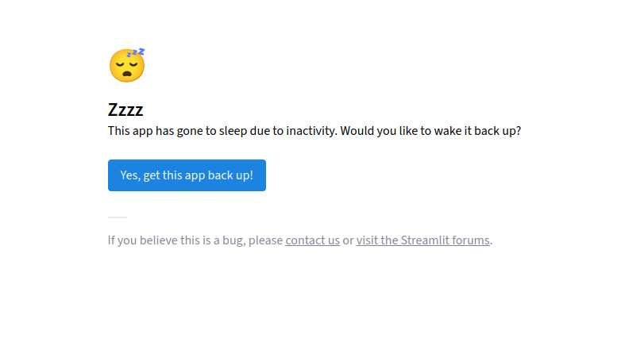

# I2A2-Desafio-Extra

Criação de um agente E.D.A.. Participação individual no treinamento de agentes inteligentes.

Aluno: Wagner dos Santos Brito.

Como parte da entrega o agente está disponível nessa URL: [https://wsbrito-i2a2-desafio-extra-2025.streamlit.app/](https://wsbrito-i2a2-desafio-extra-2025.streamlit.app/).

> **Importante:**

A aplicação hospedada na cloud do Streamlit pode entrar em stand by e aparacer a seguinte tela:

Se isso ocorrer basta acionar o botão apresentado que o sistema deverá ser reiniciado normalmente.

